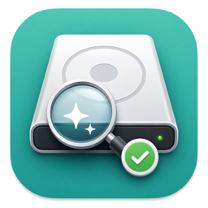
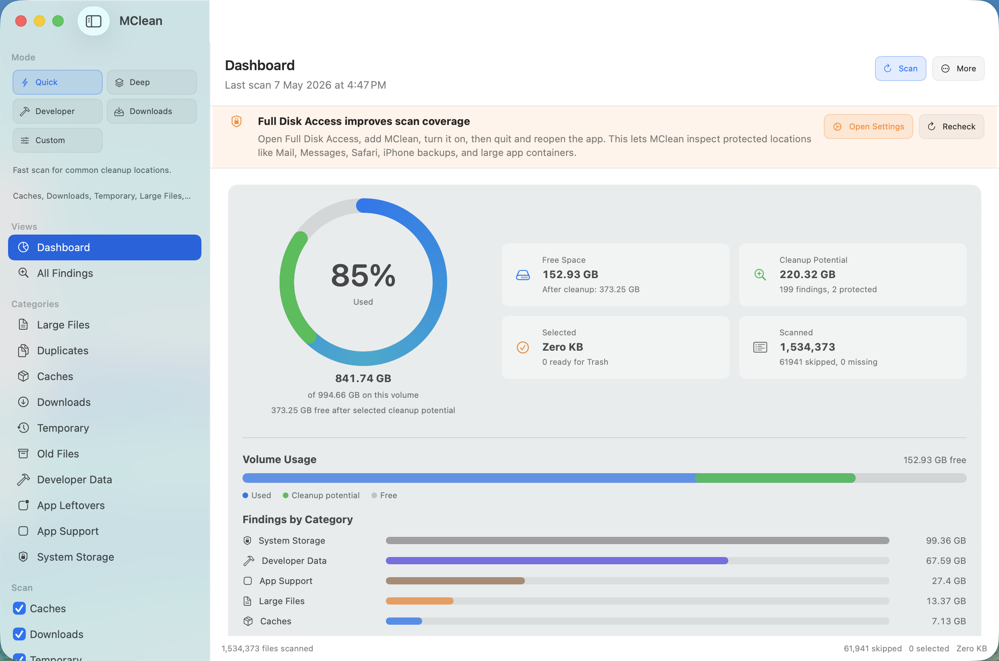
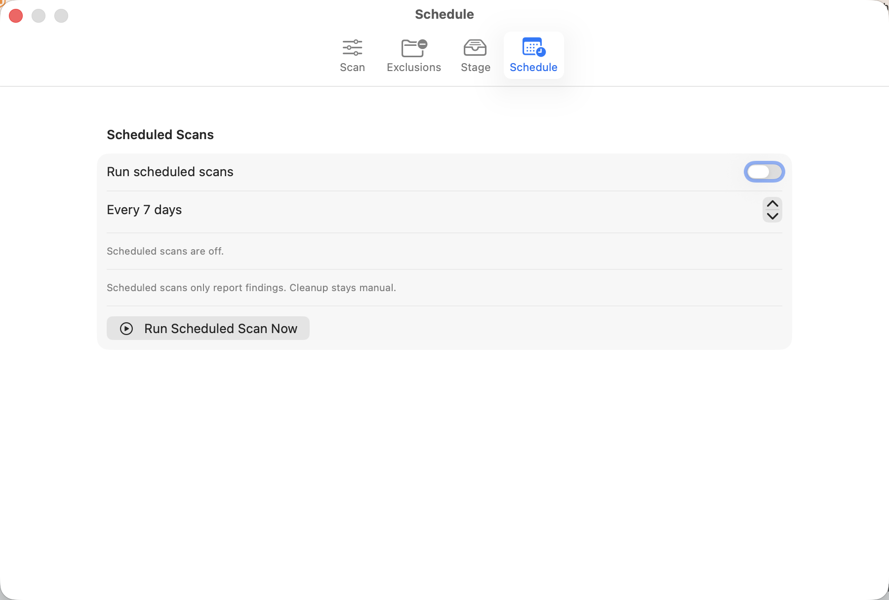

<p align="center">
  
</p>

<h1 align="center">theMClean</h1>

<p align="center">
  <strong>A native macOS cleanup scanner for finding cache, temporary, old, and large files</strong><br>
  Native SwiftUI &bull; Safe review workflow &bull; Stage or Trash cleanup
</p>

<p align="center">
  <a href="https://apps.apple.com/ae/app/themclean/id6767620941?mt=12"></a>
  <a href="https://github.com/Engagendy/mclean/releases"></a>
  
  
  
</p>

---

theMClean is a native SwiftUI macOS app for finding cleanup candidates on a Mac. It scans common cache, temporary, Downloads, large-file, developer, browser-cache, duplicate, and app-leftover locations, then lets the user review selected items, move them to Stage for testing, or move them to Trash.

<p align="center">
  
</p>

## Why theMClean

- **Designed for review, not surprise deletion.** Cleanup starts with scan results and explicit selection.
- **Stage-first workflow.** Move files to Stage, test your apps, then restore, Trash, or delete staged items.
- **Developer-aware cleanup.** Xcode, simulators, npm, pnpm, Python, Gradle, Go, Cargo, Rust, Docker, and related caches are named clearly.
- **Safer browser and app-leftover handling.** Browser cache modules avoid sensitive profile data, and leftovers are grouped by bundle with confidence labels.
- **Built-in help.** The app now includes a Help sheet with screenshots and feature guidance.

## Quick Start

1. Install from the [Mac App Store](https://apps.apple.com/ae/app/themclean/id6767620941?mt=12), Homebrew, or the latest signed DMG from [GitHub Releases](https://github.com/Engagendy/mclean/releases).
2. Open theMClean and press **Scan**. The app does not scan automatically on launch.
3. Review the streamed results, sort by size, select the files you want, then move them to Stage for testing or move them to Trash.

## Installation

### Mac App Store

Install the latest App Store build from:

https://apps.apple.com/ae/app/themclean/id6767620941?mt=12

### Homebrew (recommended)

```bash
brew tap Engagendy/tap
brew install --cask mclean
```

### Direct Download

1. Download the latest `.dmg` from [GitHub Releases](https://github.com/Engagendy/mclean/releases).
2. Open the DMG and drag **theMClean** to your Applications folder.
3. Open the app from Applications.

### Gatekeeper Bypass

GitHub DMG builds are signed and notarized. If macOS still shows a launch warning after a manual download, use one of these options:

**Option A - Right-click Open (recommended):** right-click or Control-click the app, choose **Open**, then click **Open**.

**Option B - Remove quarantine attribute:**

```bash
xattr -cr /Applications/theMClean.app
```

**Option C - System Settings:** go to **System Settings -> Privacy & Security**, scroll down, and click **Open Anyway** next to the theMClean message.

### Full Disk Access

theMClean can scan normal user folders without Full Disk Access. macOS blocks some protected locations unless you grant access.

1. Open theMClean.
2. Click **Open Full Disk Access** in the banner, or open **System Settings -> Privacy & Security -> Full Disk Access**.
3. Add **theMClean** from `/Applications`.
4. Turn the switch on for theMClean.
5. Quit and reopen theMClean, then scan again.

## Latest Updates

- Available on the Mac App Store as **theMClean**.
- Signed and notarized GitHub DMG builds for direct download.
- Stage-first cleanup workflow with restore, Trash, and permanent delete options from Stage.
- Better cleanup coverage for app leftovers, browser caches, developer caches, duplicates, and Docker preview items.
- In-app Help with screenshots for scan modes, review flow, Stage, Settings, and Full Disk Access.

## Features

- Native macOS sidebar, toolbar, sortable table, and multi-selection.
- Quick, Deep, and Custom scan modes.
- Live streaming scan results with phase progress, remaining-phase estimates, and category skipping.
- Previous scan results are restored on launch and refreshed on the next scan.
- Full Disk Access guidance for protected macOS locations.
- Review-before-delete sheet with high-risk and missing-file warnings.
- Stage workflow for testing after files are moved out of their original locations, with stale-item reminders.
- Stage-first settings can hide direct Trash actions for a more cautious cleanup flow.
- Settings with persisted scan options and folder exclusions.
- Saved custom scan profiles built from the current scan toggles.
- Search and advanced filters for size, modified date, risk, protection, source, and path.
- File previews for images, text, PDFs, video metadata, and unsupported-file metadata.
- Browser cache scanning for Safari, Chrome, Edge, and Firefox with profile warnings.
- App leftover review grouped by bundle ID with confidence labels, broader installed-app inventory, and receipt/launch-agent/log coverage.
- Duplicate review with grouped identical files and keep-helper selection actions.
- Opt-in scheduled scans with macOS notification summaries and manual-only cleanup.
- Never-delete protection for sensitive macOS and user-library locations.
- File details panel with risk, protection, duplicate, and app-leftover metadata.
- Trash history with restore support for recently moved items.
- Duplicate file grouping and app-leftover detection.
- Developer cleanup coverage for Xcode, simulators, npm, pnpm, Python `__pycache__`, Gradle, review-only Docker storage, Go, Cargo, and related caches.

## Screenshots

### Dashboard

The dashboard summarizes disk usage, cleanup potential, selected bytes, scan progress, and category totals.


### Settings

Settings manage scan profiles, exclusions, Stage reminders, scheduled scan reporting, and direct Trash visibility.



## In-App Help

Open **Help** from the dashboard action menu or the findings toolbar. The Help sheet explains scan modes, review workflow, Stage, settings, and Full Disk Access with product screenshots.

## Roadmap

The tracked implementation plan lives in [IMPLEMENTATION_PLAN.md](IMPLEMENTATION_PLAN.md). It covers cleanup coverage, user experience, and power features with task status and acceptance criteria.

## Safety Model

theMClean defaults to reversible cleanup paths. Selected items can be moved to Stage first, then restored, moved to Trash, or permanently deleted from the Stage view after confirmation. The direct cleanup action still moves selected items to the macOS Trash so the user can restore them if needed.

## Build

### Requirements

| Requirement | Version |
|-------------|---------|
| macOS | 14.0 Sonoma or later |
| Xcode | 16.0+ recommended |
| Homebrew | Optional, for cask installation |

### Development Setup

```bash
git clone https://github.com/Engagendy/mclean.git
cd mclean
open MClean.xcodeproj
```

Select the **MClean** scheme, choose **My Mac** as the destination, and run the app.

### Building a DMG for Distribution

```bash
./scripts/package.sh --version 1.0.11
```

The packaged DMG is written to `build/theMClean-<version>-<arch>.dmg`.

Options: `--arch arm64|x86_64`, `--version X.Y.Z`, `--sign`, `--identity NAME`, `--notarize`, `--notary-profile NAME`

### Signed Release Build

To build a Developer ID signed DMG:

```bash
./scripts/package.sh --version 1.0.11 --arch arm64 --sign
```

To sign, notarize, and staple the DMG:

```bash
xcrun notarytool store-credentials mclean-notary \
  --apple-id YOUR_APPLE_ID_EMAIL \
  --team-id YOUR_TEAM_ID \
  --password YOUR_APP_SPECIFIC_PASSWORD

./scripts/package.sh --version 1.0.11 --arch arm64 --sign --notarize --notary-profile mclean-notary
```

Signing requires a **Developer ID Application** certificate in the local keychain. In Xcode, open **Settings -> Accounts**, select the Apple Developer account, then manage certificates and add/download **Developer ID Application**.

### Mac App Store Build

The Xcode project is configured for App Store/Xcode Cloud builds with:

- Product name: `theMClean`
- Bundle identifier: `com.engagendy.MClean`
- Team ID: `7JM77223V5`
- App Store sandbox entitlements: `MClean/Resources/MCleanAppStore.entitlements`

The direct GitHub DMG build signs with `MClean/Resources/MCleanDirect.entitlements` so it can remain separate from the Mac App Store sandbox profile.

### Command-Line Scan

```bash
/Applications/theMClean.app/Contents/MacOS/theMClean --cli-scan --profile quick --max-results 500
```

CLI mode writes JSON scan results only. It never stages, trashes, or deletes files.

## Release

Releases follow the same pattern as the MPP Viewer project:

```bash
git tag v1.0.11
git push origin v1.0.11
```

On tag push, GitHub Actions:

- builds the DMG on macOS
- creates the GitHub release
- attaches the DMG release asset
- updates `Engagendy/homebrew-tap` with the new cask version and SHA256

The automatic tap update requires a `HOMEBREW_TAP_TOKEN` repository secret on `Engagendy/mclean`. Use a fine-grained GitHub token with Contents read/write access to `Engagendy/homebrew-tap`.

Repository: https://github.com/Engagendy/mclean
